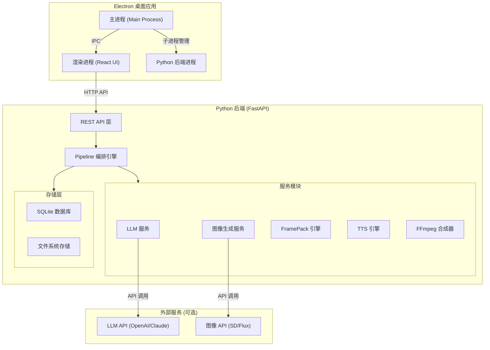
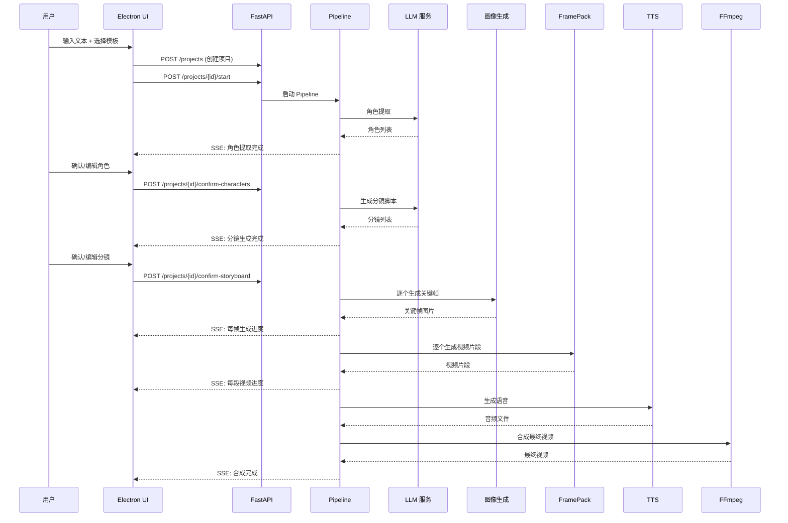

# 设计文档

## 概述

AI 视频生成器采用前后端分离架构：Electron + React 作为桌面客户端，Python FastAPI 作为后端服务。参考 Toonflow 的 AI Agent 编排引擎思路，系统将文本到视频的流程拆解为六个自动化阶段（文本输入 → 角色提取 → 分镜生成 → 关键帧生成 → FramePack 视频生成 → 合成导出），每个阶段由独立的服务模块驱动。

Electron 主进程负责管理 Python 后端的生命周期（通过子进程启动/停止），渲染进程通过 HTTP API 与 Python 后端通信。FramePack 作为本地 GPU 推理引擎集成在 Python 后端中，图像生成支持本地模型和外部 API 两种模式。

### 关键技术决策

1. **前后端通信**：Electron 通过 HTTP REST API 调用 Python 后端，而非 IPC 或 WebSocket，简化架构且便于调试
2. **FramePack 集成**：直接在 Python 后端中以库的形式调用 FramePack，而非启动独立的 Gradio 服务，减少资源开销
3. **项目数据存储**：使用文件系统 + SQLite 的混合方案，SQLite 存储项目元数据和结构化数据，文件系统存储图片/视频/音频等二进制资源
4. **Pipeline 编排**：采用状态机模式管理 Pipeline 各阶段的执行、暂停、重试和恢复

## 架构



### 数据流



## 组件与接口

### 1. Electron 主进程 (MainProcess)

负责应用窗口管理和 Python 后端生命周期管理。

```typescript
// main/python-manager.ts
interface PythonManager {
  start(): Promise<void>;          // 启动 Python 后端
  stop(): Promise<void>;           // 停止 Python 后端
  restart(): Promise<void>;        // 重启 Python 后端
  healthCheck(): Promise<boolean>; // 健康检查
  getStatus(): ProcessStatus;      // 获取进程状态
}

type ProcessStatus = 'starting' | 'running' | 'stopped' | 'error';

// main/config-store.ts
interface AppConfig {
  pythonPath: string;              // Python 解释器路径
  gpuDevice: number;               // GPU 设备编号
  backendPort: number;             // 后端服务端口
  llmApiKey: string;               // LLM API 密钥
  llmApiUrl: string;               // LLM API 地址
  imageGenApiKey: string;          // 图像生成 API 密钥
  imageGenApiUrl: string;          // 图像生成 API 地址
  ttsEngine: 'edge-tts' | 'chattts'; // TTS 引擎选择
}
```

### 2. React 前端 (Renderer)

基于 React + TypeScript 的 UI 层，使用 React Router 管理页面路由。

```typescript
// 页面路由结构
// /                    - 项目列表页
// /project/:id         - 项目工作台
// /project/:id/text    - 文本输入
// /project/:id/chars   - 角色管理
// /project/:id/story   - 分镜编辑
// /project/:id/preview - 视频预览
// /settings            - 设置页

// services/api-client.ts
interface ApiClient {
  // 项目管理
  createProject(data: CreateProjectRequest): Promise<Project>;
  listProjects(): Promise<Project[]>;
  getProject(id: string): Promise<Project>;
  deleteProject(id: string): Promise<void>;
  
  // Pipeline 控制
  startPipeline(projectId: string, step: PipelineStep): Promise<void>;
  cancelPipeline(projectId: string): Promise<void>;
  
  // 角色管理
  getCharacters(projectId: string): Promise<Character[]>;
  updateCharacter(projectId: string, charId: string, data: CharacterUpdate): Promise<Character>;
  confirmCharacters(projectId: string): Promise<void>;
  
  // 分镜管理
  getStoryboard(projectId: string): Promise<StoryboardScene[]>;
  updateScene(projectId: string, sceneId: string, data: SceneUpdate): Promise<StoryboardScene>;
  reorderScenes(projectId: string, order: string[]): Promise<void>;
  confirmStoryboard(projectId: string): Promise<void>;
  
  // 关键帧
  regenerateKeyframe(projectId: string, sceneId: string): Promise<void>;
  
  // 视频
  regenerateVideoClip(projectId: string, sceneId: string): Promise<void>;
  exportVideo(projectId: string, options: ExportOptions): Promise<string>;
  
  // SSE 事件流
  subscribePipelineEvents(projectId: string): EventSource;
}
```

### 3. Python 后端 API (FastAPI)

```python
# api/routes.py
# POST   /api/projects                          - 创建项目
# GET    /api/projects                          - 项目列表
# GET    /api/projects/{id}                     - 项目详情
# DELETE /api/projects/{id}                     - 删除项目
# POST   /api/projects/{id}/text                - 提交文本
# POST   /api/projects/{id}/start               - 启动 Pipeline
# POST   /api/projects/{id}/cancel              - 取消 Pipeline
# POST   /api/projects/{id}/confirm-characters  - 确认角色
# PUT    /api/projects/{id}/characters/{cid}    - 更新角色
# POST   /api/projects/{id}/confirm-storyboard  - 确认分镜
# PUT    /api/projects/{id}/scenes/{sid}        - 更新分镜
# PUT    /api/projects/{id}/scenes/reorder      - 重排分镜
# POST   /api/projects/{id}/scenes/{sid}/regenerate-keyframe  - 重新生成关键帧
# POST   /api/projects/{id}/scenes/{sid}/regenerate-video     - 重新生成视频
# POST   /api/projects/{id}/export              - 导出视频
# GET    /api/projects/{id}/events              - SSE 事件流
# GET    /api/projects/{id}/files/{path}        - 获取资源文件
# GET    /api/health                            - 健康检查
# GET    /api/config                            - 获取配置
# PUT    /api/config                            - 更新配置
```

### 4. Pipeline 编排引擎

```python
# pipeline/engine.py
class PipelineEngine:
    """Pipeline 状态机，管理视频生成的完整流程"""
    
    async def start(self, project_id: str) -> None: ...
    async def cancel(self, project_id: str) -> None: ...
    async def resume(self, project_id: str, from_step: PipelineStep) -> None: ...
    def get_status(self, project_id: str) -> PipelineStatus: ...

class PipelineStep(str, Enum):
    CHARACTER_EXTRACTION = "character_extraction"
    STORYBOARD_GENERATION = "storyboard_generation"
    KEYFRAME_GENERATION = "keyframe_generation"
    VIDEO_GENERATION = "video_generation"
    TTS_GENERATION = "tts_generation"
    COMPOSITION = "composition"

class PipelineStatus:
    current_step: PipelineStep
    progress: float          # 0.0 - 1.0
    step_detail: str         # 当前步骤的详细描述
    estimated_remaining: int # 预计剩余秒数
```


### 5. LLM 服务

```python
# services/llm_service.py
class LLMService:
    """封装 LLM API 调用，支持 OpenAI 兼容接口"""
    
    async def extract_characters(self, text: str, template: ContentTemplate) -> list[Character]:
        """从文本中提取角色信息"""
        ...
    
    async def generate_storyboard(
        self, text: str, characters: list[Character], template: ContentTemplate
    ) -> list[StoryboardScene]:
        """将文本拆解为分镜脚本"""
        ...

class Character:
    id: str
    name: str
    appearance: str      # 外貌描述
    personality: str     # 性格特征
    background: str      # 背景信息
    image_prompt: str    # 用于图像生成的 prompt

class StoryboardScene:
    id: str
    order: int
    scene_description: str   # 场景描述
    dialogue: str            # 台词/旁白
    camera_direction: str    # 镜头指示
    image_prompt: str        # 图像生成 prompt
    motion_prompt: str       # FramePack 运动 prompt
```

### 6. 图像生成服务

```python
# services/image_service.py
class ImageGeneratorService:
    """图像生成服务，支持外部 API 和本地模型"""
    
    async def generate_keyframe(
        self, scene: StoryboardScene, characters: list[Character],
        style_config: dict
    ) -> str:
        """生成单个分镜的关键帧图片，返回文件路径"""
        ...
    
    async def regenerate_keyframe(
        self, scene: StoryboardScene, characters: list[Character],
        style_config: dict
    ) -> str:
        """重新生成关键帧"""
        ...
```

### 7. FramePack 引擎

```python
# services/framepack_service.py
class FramePackService:
    """FramePack 视频生成引擎封装"""
    
    def __init__(self, gpu_device: int = 0):
        self.model = None
        self.gpu_device = gpu_device
    
    async def load_model(self) -> None:
        """加载 FramePack 模型到 GPU"""
        ...
    
    async def unload_model(self) -> None:
        """卸载模型释放显存"""
        ...
    
    async def generate_video(
        self, image_path: str, prompt: str, 
        duration: float = 5.0, fps: int = 30,
        use_teacache: bool = True
    ) -> str:
        """将关键帧图片转化为动态视频片段，返回视频文件路径"""
        ...
    
    def get_gpu_info(self) -> dict:
        """获取 GPU 信息（显存、型号等）"""
        ...
```

### 8. TTS 引擎（可插拔架构）

TTS 采用可插拔的适配器模式，便于后续接入更多引擎。当前支持免费引擎（Edge-TTS、ChatTTS），并预留主流收费模型的适配器接口。

```python
# services/tts_service.py
from abc import ABC, abstractmethod

class TTSAdapter(ABC):
    """TTS 适配器基类，所有引擎实现此接口"""
    
    @abstractmethod
    async def generate_speech(self, text: str, voice_id: str) -> str:
        """生成语音音频，返回文件路径"""
        ...
    
    @abstractmethod
    async def list_voices(self) -> list[VoiceInfo]:
        """列出可用的语音列表"""
        ...
    
    @abstractmethod
    def get_engine_info(self) -> EngineInfo:
        """返回引擎信息（名称、是否收费、支持语言等）"""
        ...

class EdgeTTSAdapter(TTSAdapter):
    """Edge-TTS 适配器（免费）"""
    ...

class ChatTTSAdapter(TTSAdapter):
    """ChatTTS 适配器（免费，本地运行）"""
    ...

# 预留的收费模型适配器位置，后续迭代开发
class FishSpeechAdapter(TTSAdapter):
    """Fish Speech 适配器（收费，高质量中文语音）"""
    ...

class CosyVoiceAdapter(TTSAdapter):
    """CosyVoice (阿里) 适配器（收费，多语言高质量）"""
    ...

class MiniMaxTTSAdapter(TTSAdapter):
    """MiniMax TTS 适配器（收费，情感丰富）"""
    ...

class VolcEngineTTSAdapter(TTSAdapter):
    """火山引擎 TTS 适配器（收费，字节跳动，抖音同款音色）"""
    ...

class TTSService:
    """TTS 服务管理器，根据配置选择适配器"""
    
    def __init__(self):
        self.adapters: dict[str, TTSAdapter] = {}
        self._register_default_adapters()
    
    def _register_default_adapters(self):
        self.adapters["edge-tts"] = EdgeTTSAdapter()
        self.adapters["chattts"] = ChatTTSAdapter()
        # 收费引擎在用户配置 API Key 后按需注册
    
    def register_adapter(self, name: str, adapter: TTSAdapter):
        """注册新的 TTS 适配器"""
        self.adapters[name] = adapter
    
    async def generate_speech(
        self, text: str, voice_id: str, engine: str = "edge-tts"
    ) -> str:
        adapter = self.adapters.get(engine)
        if not adapter:
            raise ValueError(f"TTS engine '{engine}' not registered")
        return await adapter.generate_speech(text, voice_id)
    
    async def list_voices(self, engine: str) -> list[VoiceInfo]:
        adapter = self.adapters.get(engine)
        if not adapter:
            raise ValueError(f"TTS engine '{engine}' not registered")
        return await adapter.list_voices()
    
    def list_engines(self) -> list[EngineInfo]:
        """列出所有已注册的引擎"""
        return [a.get_engine_info() for a in self.adapters.values()]

class VoiceInfo:
    id: str
    name: str
    language: str
    gender: str
    preview_url: str | None

class EngineInfo:
    name: str
    display_name: str
    is_paid: bool
    supported_languages: list[str]
    requires_api_key: bool
    description: str
```

### 9. FFmpeg 合成器

```python
# services/ffmpeg_service.py
class FFmpegCompositor:
    """FFmpeg 视频合成服务"""
    
    async def compose_final_video(
        self, project_id: str, scenes: list[CompositionScene],
        output_config: OutputConfig
    ) -> str:
        """合成最终视频，返回输出文件路径"""
        ...
    
    async def add_subtitles(
        self, video_path: str, subtitles: list[SubtitleEntry]
    ) -> str:
        """为视频添加字幕"""
        ...
    
    async def add_transitions(
        self, clips: list[str], transition_type: str = "fade",
        duration: float = 0.5
    ) -> str:
        """在视频片段之间添加转场"""
        ...

class CompositionScene:
    video_path: str
    audio_path: str | None
    subtitle_text: str | None
    start_time: float
    duration: float

class OutputConfig:
    resolution: tuple[int, int]  # (1920, 1080)
    fps: int                     # 30
    codec: str                   # "h264"
    format: str                  # "mp4"
    bitrate: str                 # "8M"
```

### 10. 内容模板系统

```python
# services/template_service.py
class ContentTemplate:
    id: str
    name: str                          # 模板名称
    type: str                          # "anime" | "science" | "math"
    character_extraction_prompt: str   # 角色提取 prompt 模板
    storyboard_prompt: str             # 分镜生成 prompt 模板
    image_style: dict                  # 图像风格参数
    motion_style: dict                 # 运动风格参数
    voice_config: dict                 # 语音配置
    subtitle_style: dict               # 字幕样式

class TemplateService:
    def list_templates(self) -> list[ContentTemplate]: ...
    def get_template(self, template_id: str) -> ContentTemplate: ...
    def create_custom_template(self, data: dict) -> ContentTemplate: ...
    def update_template(self, template_id: str, data: dict) -> ContentTemplate: ...
```

## 数据模型

### 项目数据模型 (SQLite)

```sql
-- 项目表
CREATE TABLE projects (
    id TEXT PRIMARY KEY,
    name TEXT NOT NULL,
    template_id TEXT NOT NULL,
    source_text TEXT,
    status TEXT DEFAULT 'created',  -- created/processing/paused/completed/error
    current_step TEXT,
    created_at TIMESTAMP DEFAULT CURRENT_TIMESTAMP,
    updated_at TIMESTAMP DEFAULT CURRENT_TIMESTAMP
);

-- 角色表
CREATE TABLE characters (
    id TEXT PRIMARY KEY,
    project_id TEXT NOT NULL REFERENCES projects(id) ON DELETE CASCADE,
    name TEXT NOT NULL,
    appearance TEXT,
    personality TEXT,
    background TEXT,
    image_prompt TEXT,
    confirmed BOOLEAN DEFAULT FALSE
);

-- 分镜表
CREATE TABLE scenes (
    id TEXT PRIMARY KEY,
    project_id TEXT NOT NULL REFERENCES projects(id) ON DELETE CASCADE,
    scene_order INTEGER NOT NULL,
    scene_description TEXT,
    dialogue TEXT,
    camera_direction TEXT,
    image_prompt TEXT,
    motion_prompt TEXT,
    keyframe_path TEXT,
    video_path TEXT,
    audio_path TEXT,
    duration REAL,
    confirmed BOOLEAN DEFAULT FALSE
);

-- Pipeline 状态表
CREATE TABLE pipeline_states (
    id TEXT PRIMARY KEY,
    project_id TEXT NOT NULL REFERENCES projects(id) ON DELETE CASCADE,
    step TEXT NOT NULL,
    status TEXT DEFAULT 'pending',  -- pending/running/completed/failed/cancelled
    progress REAL DEFAULT 0.0,
    error_message TEXT,
    started_at TIMESTAMP,
    completed_at TIMESTAMP
);
```

### 文件系统存储结构

```
projects/
  {project_id}/
    metadata.json          # 项目元数据缓存
    keyframes/
      scene_{id}.png       # 关键帧图片
    videos/
      scene_{id}.mp4       # 视频片段
    audio/
      scene_{id}.wav       # 语音音频
    output/
      final.mp4            # 最终合成视频
      subtitles.srt        # 字幕文件
```


## 正确性属性

*正确性属性是一种在系统所有有效执行中都应成立的特征或行为——本质上是关于系统应该做什么的形式化陈述。属性作为人类可读规范和机器可验证正确性保证之间的桥梁。*

### Property 1: 文本校验正确性
*For any* 输入字符串，文本校验函数应当：对空字符串和纯空白字符串返回无效，对长度低于最小阈值的字符串返回无效，对超过最大长度限制的字符串返回无效，对满足长度要求的非空字符串返回有效。
**Validates: Requirements 1.3, 1.5**

### Property 2: 文本存储往返一致性
*For any* 有效的文本内容，提交存储后再读取应当得到与原始输入完全相同的文本。
**Validates: Requirements 1.1**

### Property 3: 文件导入往返一致性
*For any* 有效的 TXT 或 Markdown 文件内容，导入后读取应当得到与原始文件内容等价的文本。
**Validates: Requirements 1.2**

### Property 4: 模板加载正确性
*For any* 有效的内容类型标识符，加载模板应当返回与该类型匹配的 Content_Template 配置，且配置中包含所有必要字段（character_extraction_prompt、storyboard_prompt、image_style、motion_style）。
**Validates: Requirements 1.4**

### Property 5: 角色数据持久化往返一致性
*For any* 角色数据和任意字段更新，更新角色信息后再读取应当得到包含更新内容的角色数据，且未修改的字段保持不变。
**Validates: Requirements 2.3, 2.4**

### Property 6: 分镜结构完整性不变量
*For any* 分镜脚本中的场景对象，scene_description、dialogue 和 camera_direction 三个必要字段均应存在且非空。
**Validates: Requirements 3.2**

### Property 7: 分镜更新正确性
*For any* 分镜场景和任意字段更新，更新后再读取应当得到包含更新内容的场景数据，且未修改的字段保持不变。
**Validates: Requirements 3.4**

### Property 8: 分镜重排序数据保持不变量
*For any* 分镜列表和任意排列顺序，重排序后的分镜列表应当包含与原列表完全相同的场景集合（仅顺序不同），不丢失也不重复任何场景。
**Validates: Requirements 3.5**

### Property 9: 角色语音分配唯一性
*For any* 包含多个角色的项目，TTS 语音分配函数应当为每个不同的角色分配不同的 voice_id。
**Validates: Requirements 6.2**

### Property 10: 视频合成排序与音视频同步正确性
*For any* 分镜场景集合，合成器生成的 CompositionScene 列表应当按 scene_order 排序，且每个 CompositionScene 的 audio_path 对应正确的场景音频文件。
**Validates: Requirements 7.1, 7.2**

### Property 11: 字幕生成完整性
*For any* 包含台词/旁白的分镜列表，生成的字幕文件应当包含每个场景的所有台词文本，且字幕时间戳与对应场景的时间范围一致。
**Validates: Requirements 7.3**

### Property 12: 项目持久化往返一致性
*For any* 项目数据（包括元数据、角色、分镜），保存后再加载应当得到与保存前等价的项目状态。
**Validates: Requirements 8.2, 8.3**

### Property 13: Pipeline 步骤完成后自动保存
*For any* Pipeline 步骤完成事件，完成后项目的持久化状态应当反映该步骤的完成状态和产出数据。
**Validates: Requirements 8.4**

### Property 14: 模板自定义往返一致性
*For any* 模板参数更新，更新后再读取应当得到包含更新内容的模板配置。
**Validates: Requirements 10.5**

## 错误处理

### 错误处理策略

系统采用分层错误处理策略：

1. **服务层错误**：每个服务模块（LLM、图像生成、FramePack、TTS、FFmpeg）捕获并封装自身的错误，返回统一的错误结构
2. **Pipeline 层错误**：Pipeline 引擎捕获服务层错误，根据错误类型决定重试、跳过或暂停
3. **API 层错误**：FastAPI 返回标准化的错误响应，包含错误码、消息和建议操作
4. **UI 层错误**：前端根据错误响应展示用户友好的错误信息和操作选项

### 错误响应格式

```python
class ErrorResponse:
    code: str           # 错误码，如 "LLM_TIMEOUT", "FRAMEPACK_OOM"
    message: str        # 用户可读的错误描述
    detail: str | None  # 技术细节（调试用）
    retryable: bool     # 是否可重试
    suggestion: str     # 建议的修复操作
```

### 关键错误场景

| 错误场景 | 错误码 | 处理方式 |
|---------|--------|---------|
| LLM API 超时 | LLM_TIMEOUT | 自动重试 3 次，间隔递增 |
| LLM API 返回格式错误 | LLM_PARSE_ERROR | 重试，使用更严格的 prompt |
| 图像生成 API 失败 | IMAGE_GEN_FAILED | 提示用户重试或更换 API |
| FramePack 显存不足 | FRAMEPACK_OOM | 提示降低分辨率或关闭其他 GPU 程序 |
| FramePack 模型加载失败 | FRAMEPACK_LOAD_ERROR | 检查模型文件完整性，提示重新下载 |
| TTS 引擎不可用 | TTS_UNAVAILABLE | 切换到备用引擎 |
| FFmpeg 未安装 | FFMPEG_NOT_FOUND | 提示安装 FFmpeg 并配置路径 |
| FFmpeg 合成失败 | FFMPEG_ERROR | 显示 FFmpeg 错误日志，提示检查输入文件 |
| Python 后端启动失败 | BACKEND_START_ERROR | 显示诊断信息（Python 版本、依赖） |
| Python 后端崩溃 | BACKEND_CRASH | 自动重启，保留已完成的中间结果 |
| 磁盘空间不足 | DISK_FULL | 提示清理空间或更换存储路径 |

## 测试策略

### 双重测试方法

系统采用单元测试和属性测试相结合的方式确保正确性：

- **单元测试**：验证具体示例、边界情况和错误条件
- **属性测试**：验证跨所有输入的通用属性

### 属性测试配置

- **测试库**：Python 端使用 `hypothesis`，TypeScript 端使用 `fast-check`
- **最小迭代次数**：每个属性测试至少运行 100 次
- **标注格式**：每个测试用注释引用设计文档中的属性编号
  - 格式：`Feature: ai-video-generator, Property {number}: {property_text}`

### 测试分层

| 测试层 | 范围 | 工具 |
|-------|------|------|
| Python 单元测试 | 服务模块逻辑 | pytest |
| Python 属性测试 | 数据模型、校验、转换 | pytest + hypothesis |
| TypeScript 单元测试 | 前端组件、API 客户端 | vitest |
| TypeScript 属性测试 | 数据校验、状态管理 | vitest + fast-check |
| API 集成测试 | FastAPI 端点 | pytest + httpx |

### 属性测试覆盖

每个正确性属性（Property 1-14）对应一个独立的属性测试用例：

- Property 1-3（文本相关）：Python hypothesis 测试，生成随机文本字符串
- Property 4（模板加载）：Python hypothesis 测试，生成随机模板类型
- Property 5-8（角色和分镜）：Python hypothesis 测试，生成随机角色/分镜数据
- Property 9（语音分配）：Python hypothesis 测试，生成随机角色列表
- Property 10-11（合成相关）：Python hypothesis 测试，生成随机场景集合
- Property 12-13（项目持久化）：Python hypothesis 测试，生成随机项目数据
- Property 14（模板自定义）：Python hypothesis 测试，生成随机模板参数

### 单元测试重点

- 错误处理路径（LLM 失败、图像生成失败、FramePack 失败等）
- 边界条件（空输入、超长文本、单场景项目）
- FFmpeg 命令构建的正确性
- API 端点的请求/响应格式
- Pipeline 状态机的状态转换
