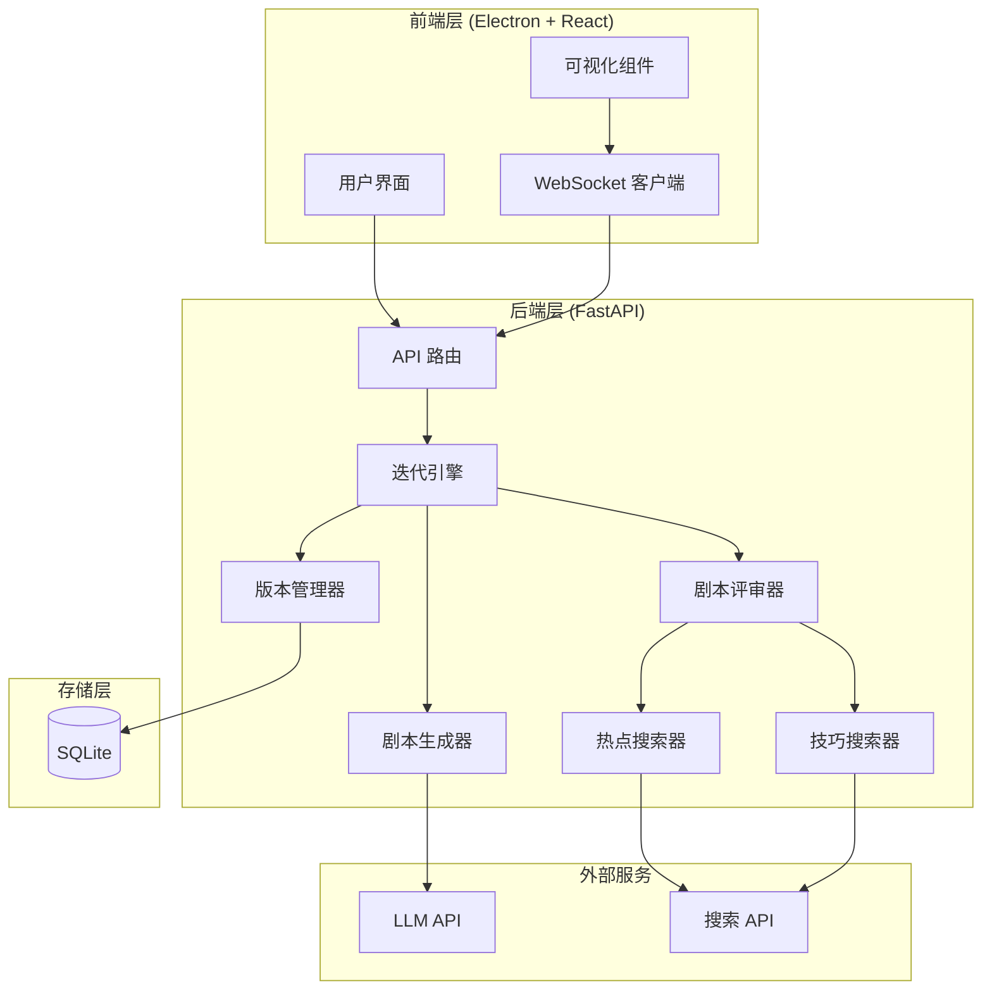
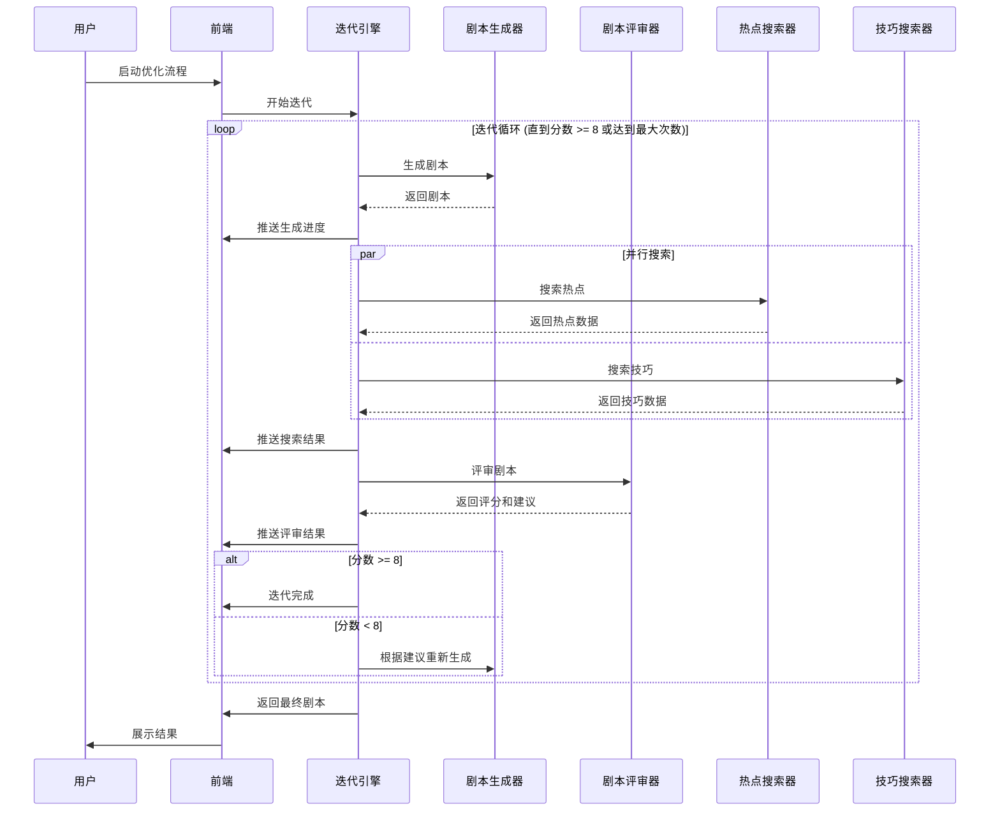

# 设计文档：剧本迭代优化系统

## 概述

剧本迭代优化系统是一个基于反馈循环的智能优化系统，通过多轮迭代自动提升剧本质量。系统采用生成-评审-优化的循环架构，结合实时网络数据和专业创作技巧，为用户提供高质量的视频剧本。

核心设计理念：

- **迭代优化**：通过多轮反馈循环持续改进剧本质量
- **多维评审**：从多个专业维度全面评估剧本
- **智能搜索**：利用实时网络数据增强剧本相关性
- **可视化反馈**：通过炫酷的前端界面展示优化过程

## 架构

### 系统架构图



### 核心流程



## 组件和接口

### 1. 迭代引擎 (Iteration Engine)

**职责**：控制整个迭代流程，协调各组件工作

**接口**：

```python
class IterationEngine:
    def __init__(
        self,
        script_generator: ScriptGenerator,
        script_evaluator: ScriptEvaluator,
        version_manager: VersionManager,
        config: IterationConfig
    ):
        """初始化迭代引擎"""
        pass

    async def optimize_script(
        self,
        initial_prompt: str,
        session_id: str,
        progress_callback: Callable[[IterationProgress], None]
    ) -> OptimizationResult:
        """
        执行剧本优化流程

        Args:
            initial_prompt: 初始剧本提示词
            session_id: 会话 ID
            progress_callback: 进度回调函数

        Returns:
            OptimizationResult: 优化结果，包含最终剧本和所有版本
        """
        pass

    async def _iteration_loop(
        self,
        prompt: str,
        session_id: str,
        progress_callback: Callable
    ) -> List[ScriptVersion]:
        """执行迭代循环"""
        pass
```

**配置**：

```python
@dataclass
class IterationConfig:
    target_score: float = 8.0  # 目标分数
    max_iterations: int = 20   # 最大迭代次数
    enable_hotspot_search: bool = True  # 启用热点搜索
    enable_technique_search: bool = True  # 启用技巧搜索
    parallel_search: bool = True  # 并行搜索
```

### 2. 剧本生成器 (Script Generator)

**职责**：调用 LLM API 生成和优化剧本

**接口**：

```python
class ScriptGenerator:
    def __init__(self, llm_service: LLMService):
        """初始化剧本生成器"""
        pass

    async def generate_initial_script(
        self,
        prompt: str
    ) -> str:
        """
        生成初始剧本

        Args:
            prompt: 用户输入的剧本提示词

        Returns:
            str: 生成的剧本内容
        """
        pass

    async def regenerate_script(
        self,
        previous_script: str,
        evaluation: EvaluationResult,
        hotspots: List[Hotspot],
        techniques: List[Technique]
    ) -> str:
        """
        根据评审结果重新生成剧本

        Args:
            previous_script: 上一版本剧本
            evaluation: 评审结果
            hotspots: 热点信息
            techniques: 技巧建议

        Returns:
            str: 优化后的剧本内容
        """
        pass

    def _build_regeneration_prompt(
        self,
        previous_script: str,
        evaluation: EvaluationResult,
        hotspots: List[Hotspot],
        techniques: List[Technique]
    ) -> str:
        """构建重新生成的提示词"""
        pass
```

### 3. 剧本评审器 (Script Evaluator)

**职责**：多维度评审剧本并生成改进建议

**接口**：

```python
class ScriptEvaluator:
    def __init__(
        self,
        llm_service: LLMService,
        hotspot_searcher: HotspotSearcher,
        technique_searcher: TechniqueSearcher,
        weights: DimensionWeights
    ):
        """初始化剧本评审器"""
        pass

    async def evaluate_script(
        self,
        script: str,
        hotspots: List[Hotspot],
        techniques: List[Technique]
    ) -> EvaluationResult:
        """
        评审剧本

        Args:
            script: 剧本内容
            hotspots: 热点信息
            techniques: 技巧信息

        Returns:
            EvaluationResult: 评审结果
        """
        pass

    def _calculate_total_score(
        self,
        dimension_scores: DimensionScores
    ) -> float:
        """计算总分"""
        pass

    def _generate_suggestions(
        self,
        script: str,
        dimension_scores: DimensionScores,
        hotspots: List[Hotspot],
        techniques: List[Technique]
    ) -> List[str]:
        """生成改进建议"""
        pass
```

**评审维度**：

```python
@dataclass
class DimensionScores:
    content_quality: float      # 内容质量 (0-10)
    structure: float            # 结构完整性 (0-10)
    creativity: float           # 创意性 (0-10)
    hotspot_relevance: float    # 热点相关性 (0-10)
    technique_application: float # 技巧运用 (0-10)

@dataclass
class DimensionWeights:
    content_quality: float = 0.3
    structure: float = 0.2
    creativity: float = 0.2
    hotspot_relevance: float = 0.15
    technique_application: float = 0.15
```

**评审结果**：

```python
@dataclass
class EvaluationResult:
    total_score: float
    dimension_scores: DimensionScores
    suggestions: List[str]
    timestamp: datetime
```

### 4. 热点搜索器 (Hotspot Searcher)

**职责**：搜索网络实时热点

**接口**：

```python
class HotspotSearcher:
    def __init__(
        self,
        search_api_client: SearchAPIClient,
        config: SearchConfig
    ):
        """初始化热点搜索器"""
        pass

    async def search_hotspots(
        self,
        script: str,
        topic: str
    ) -> List[Hotspot]:
        """
        搜索相关热点

        Args:
            script: 剧本内容
            topic: 剧本主题

        Returns:
            List[Hotspot]: 热点列表
        """
        pass

    def _extract_keywords(self, script: str, topic: str) -> List[str]:
        """提取搜索关键词"""
        pass

    async def _call_search_api(
        self,
        keywords: List[str]
    ) -> List[Dict]:
        """调用搜索 API"""
        pass

    def _parse_hotspot_results(
        self,
        raw_results: List[Dict]
    ) -> List[Hotspot]:
        """解析搜索结果"""
        pass
```

**数据模型**：

```python
@dataclass
class Hotspot:
    title: str
    description: str
    source: str
    relevance_score: float
    timestamp: datetime
```

### 5. 技巧搜索器 (Technique Searcher)

**职责**：搜索剧本创作技巧

**接口**：

```python
class TechniqueSearcher:
    def __init__(
        self,
        search_api_client: SearchAPIClient,
        fallback_techniques: List[Technique],
        config: SearchConfig
    ):
        """初始化技巧搜索器"""
        pass

    async def search_techniques(
        self,
        script: str,
        script_type: str,
        weaknesses: List[str]
    ) -> List[Technique]:
        """
        搜索创作技巧

        Args:
            script: 剧本内容
            script_type: 剧本类型
            weaknesses: 剧本缺陷

        Returns:
            List[Technique]: 技巧列表
        """
        pass

    def _build_search_query(
        self,
        script_type: str,
        weaknesses: List[str]
    ) -> str:
        """构建搜索查询"""
        pass

    async def _call_search_api(
        self,
        query: str
    ) -> List[Dict]:
        """调用搜索 API"""
        pass

    def _parse_technique_results(
        self,
        raw_results: List[Dict]
    ) -> List[Technique]:
        """解析搜索结果"""
        pass

    def _get_fallback_techniques(
        self,
        script_type: str
    ) -> List[Technique]:
        """获取降级技巧库"""
        pass
```

**数据模型**：

```python
@dataclass
class Technique:
    name: str
    description: str
    example: str
    category: str
    source: str
```

### 6. 版本管理器 (Version Manager)

**职责**：管理剧本版本历史

**接口**：

```python
class VersionManager:
    def __init__(self, db_session: Session):
        """初始化版本管理器"""
        pass

    async def save_version(
        self,
        session_id: str,
        iteration: int,
        script: str,
        evaluation: EvaluationResult,
        hotspots: List[Hotspot],
        techniques: List[Technique]
    ) -> ScriptVersion:
        """保存剧本版本"""
        pass

    async def get_versions(
        self,
        session_id: str
    ) -> List[ScriptVersion]:
        """获取所有版本"""
        pass

    async def get_version(
        self,
        session_id: str,
        iteration: int
    ) -> Optional[ScriptVersion]:
        """获取特定版本"""
        pass

    async def mark_final_version(
        self,
        session_id: str,
        iteration: int
    ) -> None:
        """标记最终版本"""
        pass
```

**数据模型**：

```python
@dataclass
class ScriptVersion:
    session_id: str
    iteration: int
    script: str
    evaluation: EvaluationResult
    hotspots: List[Hotspot]
    techniques: List[Technique]
    timestamp: datetime
    is_final: bool = False
```

### 7. 搜索 API 客户端 (Search API Client)

**职责**：封装第三方搜索 API 调用

**接口**：

```python
class SearchAPIClient:
    def __init__(
        self,
        api_key: str,
        api_endpoint: str,
        retry_config: RetryConfig
    ):
        """初始化搜索 API 客户端"""
        pass

    async def search(
        self,
        query: str,
        search_type: str = "web",
        limit: int = 10
    ) -> List[Dict]:
        """
        执行搜索

        Args:
            query: 搜索查询
            search_type: 搜索类型 (web, news, etc.)
            limit: 结果数量限制

        Returns:
            List[Dict]: 搜索结果
        """
        pass

    async def _execute_with_retry(
        self,
        request_func: Callable
    ) -> Any:
        """带重试的请求执行"""
        pass
```

**重试配置**：

```python
@dataclass
class RetryConfig:
    max_retries: int = 3
    retry_delay: float = 1.0
    backoff_factor: float = 2.0
```

### 8. WebSocket 管理器

**职责**：实时推送迭代进度

**接口**：

```python
class WebSocketManager:
    def __init__(self):
        """初始化 WebSocket 管理器"""
        self.active_connections: Dict[str, WebSocket] = {}

    async def connect(self, session_id: str, websocket: WebSocket):
        """建立连接"""
        pass

    async def disconnect(self, session_id: str):
        """断开连接"""
        pass

    async def send_progress(
        self,
        session_id: str,
        progress: IterationProgress
    ):
        """发送进度更新"""
        pass
```

**进度数据**：

```python
@dataclass
class IterationProgress:
    session_id: str
    current_iteration: int
    total_iterations: int
    stage: str  # "generating", "searching", "evaluating", "completed"
    current_score: Optional[float]
    message: str
    data: Optional[Dict] = None
```

## 数据模型

### 数据库表结构

```sql
-- 优化会话表
CREATE TABLE optimization_sessions (
    id TEXT PRIMARY KEY,
    initial_prompt TEXT NOT NULL,
    target_score REAL NOT NULL,
    max_iterations INTEGER NOT NULL,
    created_at TIMESTAMP NOT NULL,
    completed_at TIMESTAMP,
    status TEXT NOT NULL  -- "running", "completed", "failed"
);

-- 剧本版本表
CREATE TABLE script_versions (
    id INTEGER PRIMARY KEY AUTOINCREMENT,
    session_id TEXT NOT NULL,
    iteration INTEGER NOT NULL,
    script TEXT NOT NULL,
    total_score REAL NOT NULL,
    dimension_scores TEXT NOT NULL,  -- JSON
    suggestions TEXT NOT NULL,  -- JSON
    hotspots TEXT,  -- JSON
    techniques TEXT,  -- JSON
    is_final BOOLEAN DEFAULT FALSE,
    created_at TIMESTAMP NOT NULL,
    FOREIGN KEY (session_id) REFERENCES optimization_sessions(id),
    UNIQUE(session_id, iteration)
);

-- 搜索缓存表（可选，用于减少 API 调用）
CREATE TABLE search_cache (
    id INTEGER PRIMARY KEY AUTOINCREMENT,
    query_hash TEXT UNIQUE NOT NULL,
    search_type TEXT NOT NULL,
    results TEXT NOT NULL,  -- JSON
    created_at TIMESTAMP NOT NULL,
    expires_at TIMESTAMP NOT NULL
);
```

## 前端可视化设计

### 组件结构

```
ScriptOptimizationView/
├── OptimizationPanel/          # 主面板
│   ├── ControlPanel/           # 控制面板
│   ├── ProgressPanel/          # 进度面板
│   └── ResultPanel/            # 结果面板
├── IterationVisualizer/        # 迭代可视化
│   ├── ScoreChart/             # 分数曲线图
│   ├── RadarChart/             # 维度雷达图
│   └── TimelineView/           # 时间线视图
├── SearchVisualizer/           # 搜索可视化
│   ├── SearchAnimation/        # 搜索动画
│   ├── HotspotList/            # 热点列表
│   └── TechniqueList/          # 技巧列表
└── VersionHistory/             # 版本历史
    ├── VersionList/            # 版本列表
    └── VersionComparison/      # 版本对比
```

### 动画效果

1. **生成动画**：
   - 打字机效果展示剧本生成
   - 粒子效果表示 AI 思考过程

2. **搜索动画**：
   - 雷达扫描效果
   - 数据流动效果
   - 结果卡片飞入动画

3. **评分动画**：
   - 数字滚动效果
   - 雷达图渐变展开
   - 进度条填充动画

4. **迭代动画**：
   - 循环箭头动画
   - 分数曲线实时绘制
   - 里程碑标记闪烁

### 状态管理

```typescript
interface OptimizationState {
  sessionId: string;
  status: "idle" | "running" | "completed" | "error";
  currentIteration: number;
  maxIterations: number;
  currentStage: "generating" | "searching" | "evaluating" | "completed";
  versions: ScriptVersion[];
  currentScore: number | null;
  scoreHistory: number[];
  hotspots: Hotspot[];
  techniques: Technique[];
  error: string | null;
}
```

## 正确性属性

属性是一种特征或行为，应该在系统的所有有效执行中保持为真——本质上是关于系统应该做什么的形式化陈述。属性是人类可读规范和机器可验证正确性保证之间的桥梁。

### 属性 1：迭代启动完整性

*对于任何*初始提示词，当启动优化流程时，系统应该生成初始剧本并至少执行一次迭代循环。

**验证：需求 1.1**

### 属性 2：迭代评审一致性

*对于任何*剧本内容，完成一次迭代后，系统应该返回包含总分和五个维度分数的评审结果。

**验证：需求 1.2, 2.1, 2.3**

### 属性 3：迭代继续条件

*对于任何*评审分数小于目标分数且未达到最大迭代次数的情况，系统应该继续生成新版本剧本。

**验证：需求 1.3**

### 属性 4：迭代终止条件

*对于任何*评审分数大于或等于目标分数的情况，系统应该终止迭代并返回最终剧本。

**验证：需求 1.4**

### 属性 5：加权平均计算正确性

*对于任何*五个维度分数和对应权重，计算的总分应该等于各维度分数的加权平均值（误差 < 0.01）。

**验证：需求 2.2**

### 属性 6：改进建议生成

*对于任何*评审结果，系统应该生成至少一条改进建议。

**验证：需求 2.4**

### 属性 7：搜索关键词提取

*对于任何*非空剧本内容和主题，搜索器应该能够提取出至少一个关键词。

**验证：需求 3.2, 4.2**

### 属性 8：搜索结果数量保证

*对于任何*成功的搜索请求，返回的结果列表应该包含至少 3 条信息。

**验证：需求 3.3, 4.3**

### 属性 9：版本持久化完整性

*对于任何*新生成的剧本版本，数据库中应该保存包含剧本内容、分数、评审意见和时间戳的完整记录。

**验证：需求 6.1**

### 属性 10：版本查询完整性

*对于任何*优化会话，查询历史版本应该返回该会话所有已保存版本的列表，且列表长度等于实际迭代次数。

**验证：需求 6.2, 6.3**

### 属性 11：最终版本标记

*对于任何*完成的优化会话，最后一个版本应该被标记为 is_final=True，其他版本应该为 False。

**验证：需求 6.4**

### 属性 12：API 重试机制

*对于任何*模拟的 API 失败场景，系统应该重试最多 3 次后才返回失败结果。

**验证：需求 7.2**

### 属性 13：速率限制保护

*对于任何*在短时间内（1秒）发送的多个搜索请求，系统应该确保请求间隔不小于配置的最小间隔。

**验证：需求 7.5**

### 属性 14：配置权重应用

*对于任何*自定义的维度权重配置，计算的总分应该使用新权重而不是默认权重。

**验证：需求 8.3**

### 属性 15：配置验证拒绝无效值

*对于任何*无效的配置值（如负数目标分数、零或负数最大迭代次数、权重和不为1），系统应该拒绝配置并返回验证错误。

**验证：需求 8.5**

### 属性 16：错误日志记录

*对于任何*触发的错误（API 失败、解析错误等），系统应该在日志中记录包含错误类型、错误消息和时间戳的条目。

**验证：需求 9.1**

### 属性 17：错误恢复能力

*对于任何*非关键错误（如单次搜索失败），系统应该使用降级策略继续执行而不是完全终止。

**验证：需求 9.2**

### 属性 18：迭代统计完整性

*对于任何*完成的优化会话，日志中应该包含总迭代次数、最终分数、总耗时等统计信息。

**验证：需求 9.4**

### 属性 19：并行搜索执行

*对于任何*搜索操作，热点搜索和技巧搜索应该并行执行，总耗时应该接近较慢的那个搜索（而不是两者之和）。

**验证：需求 10.1**

### 属性 20：WebSocket 进度推送

*对于任何*迭代进度更新（生成、搜索、评审），系统应该通过 WebSocket 向客户端推送包含当前阶段和数据的消息。

**验证：需求 5.2, 10.4**

## 错误处理

### 错误分类

1. **关键错误**（终止流程）：
   - 数据库连接失败
   - LLM API 完全不可用
   - 配置文件损坏

2. **可恢复错误**（降级处理）：
   - 搜索 API 调用失败 → 使用空列表或默认数据
   - 单次生成超时 → 重试或使用上一版本
   - WebSocket 连接断开 → 继续执行但不推送进度

3. **警告级错误**（记录但不影响）：
   - 搜索结果质量低
   - 评分维度部分缺失
   - 缓存写入失败

### 错误处理策略

```python
class ErrorHandler:
    @staticmethod
    async def handle_search_error(
        error: Exception,
        search_type: str
    ) -> List:
        """
        处理搜索错误
        - 记录错误日志
        - 返回空列表或默认数据
        - 不中断主流程
        """
        logger.error(f"{search_type} search failed: {error}")
        if search_type == "technique":
            return get_default_techniques()
        return []

    @staticmethod
    async def handle_generation_error(
        error: Exception,
        retry_count: int,
        max_retries: int
    ) -> Optional[str]:
        """
        处理生成错误
        - 重试最多 max_retries 次
        - 使用指数退避
        - 最终失败则抛出异常
        """
        if retry_count < max_retries:
            await asyncio.sleep(2 ** retry_count)
            return None  # 触发重试
        raise GenerationError("Failed after max retries")

    @staticmethod
    async def handle_critical_error(
        error: Exception,
        session_id: str
    ):
        """
        处理关键错误
        - 记录详细错误信息
        - 保存当前状态
        - 通知用户
        - 终止流程
        """
        logger.critical(f"Critical error in session {session_id}: {error}")
        await save_error_state(session_id, error)
        await notify_user_error(session_id, str(error))
        raise
```

### 降级策略

1. **搜索降级**：

   ```python
   # 优先级：实时搜索 > 缓存 > 默认库 > 空列表
   async def get_hotspots_with_fallback(query: str) -> List[Hotspot]:
       try:
           return await search_api.search(query)
       except APIError:
           cached = await get_cached_results(query)
           if cached:
               return cached
           return []
   ```

2. **评审降级**：

   ```python
   # 如果 LLM 评审失败，使用规则基础评分
   async def evaluate_with_fallback(script: str) -> EvaluationResult:
       try:
           return await llm_evaluate(script)
       except LLMError:
           return rule_based_evaluate(script)
   ```

3. **生成降级**：
   ```python
   # 如果优化生成失败，返回上一版本
   async def generate_with_fallback(
       previous_script: str,
       suggestions: List[str]
   ) -> str:
       try:
           return await llm_generate(previous_script, suggestions)
       except LLMError:
           logger.warning("Generation failed, using previous version")
           return previous_script
   ```

## 测试策略

### 测试方法

系统采用**双重测试方法**：单元测试和基于属性的测试相结合。

- **单元测试**：验证特定示例、边界情况和错误条件
- **属性测试**：验证所有输入的通用属性
- 两者互补，共同提供全面覆盖（单元测试捕获具体错误，属性测试验证通用正确性）

### 单元测试重点

1. **特定示例**：
   - 典型剧本生成和评审流程
   - 特定的搜索查询和结果
   - 已知的边界情况

2. **集成点**：
   - API 客户端与外部服务的交互
   - 数据库操作
   - WebSocket 连接管理

3. **边界情况**：
   - 空输入处理
   - 最大迭代次数限制
   - API 超时和失败

4. **错误条件**：
   - 各种 API 错误响应
   - 数据库连接失败
   - 无效配置

### 属性测试配置

**测试库**：使用 `hypothesis` (Python) 进行属性测试

**配置要求**：

- 每个属性测试最少运行 100 次迭代
- 每个测试必须引用设计文档中的属性
- 标签格式：`# Feature: script-iteration-optimizer, Property {number}: {property_text}`

### 属性测试示例

```python
from hypothesis import given, strategies as st
import pytest

# Feature: script-iteration-optimizer, Property 5: 加权平均计算正确性
@given(
    scores=st.tuples(
        st.floats(min_value=0, max_value=10),
        st.floats(min_value=0, max_value=10),
        st.floats(min_value=0, max_value=10),
        st.floats(min_value=0, max_value=10),
        st.floats(min_value=0, max_value=10)
    ),
    weights=st.tuples(
        st.floats(min_value=0, max_value=1),
        st.floats(min_value=0, max_value=1),
        st.floats(min_value=0, max_value=1),
        st.floats(min_value=0, max_value=1),
        st.floats(min_value=0, max_value=1)
    ).filter(lambda w: abs(sum(w) - 1.0) < 0.01)
)
def test_weighted_average_calculation(scores, weights):
    """验证加权平均计算的正确性"""
    dimension_scores = DimensionScores(*scores)
    dimension_weights = DimensionWeights(*weights)

    evaluator = ScriptEvaluator(
        llm_service=mock_llm,
        hotspot_searcher=mock_hotspot,
        technique_searcher=mock_technique,
        weights=dimension_weights
    )

    total_score = evaluator._calculate_total_score(dimension_scores)

    expected = sum(s * w for s, w in zip(scores, weights))
    assert abs(total_score - expected) < 0.01


# Feature: script-iteration-optimizer, Property 10: 版本查询完整性
@given(
    num_iterations=st.integers(min_value=1, max_value=20)
)
@pytest.mark.asyncio
async def test_version_query_completeness(num_iterations, db_session):
    """验证版本查询返回所有版本"""
    session_id = str(uuid.uuid4())
    version_manager = VersionManager(db_session)

    # 保存多个版本
    for i in range(num_iterations):
        await version_manager.save_version(
            session_id=session_id,
            iteration=i,
            script=f"Script version {i}",
            evaluation=mock_evaluation(),
            hotspots=[],
            techniques=[]
        )

    # 查询所有版本
    versions = await version_manager.get_versions(session_id)

    assert len(versions) == num_iterations
    assert all(v.session_id == session_id for v in versions)


# Feature: script-iteration-optimizer, Property 15: 配置验证拒绝无效值
@given(
    target_score=st.one_of(
        st.floats(max_value=-0.1),  # 负数
        st.floats(min_value=10.1)   # 超过最大值
    )
)
def test_config_validation_rejects_invalid_score(target_score):
    """验证配置验证拒绝无效的目标分数"""
    with pytest.raises(ValidationError):
        IterationConfig(target_score=target_score)


# Feature: script-iteration-optimizer, Property 19: 并行搜索执行
@pytest.mark.asyncio
async def test_parallel_search_execution():
    """验证搜索操作并行执行"""
    import time

    async def slow_hotspot_search(*args):
        await asyncio.sleep(0.5)
        return []

    async def slow_technique_search(*args):
        await asyncio.sleep(0.5)
        return []

    hotspot_searcher = Mock(search_hotspots=slow_hotspot_search)
    technique_searcher = Mock(search_techniques=slow_technique_search)

    start = time.time()

    # 并行执行
    hotspots, techniques = await asyncio.gather(
        hotspot_searcher.search_hotspots("test", "topic"),
        technique_searcher.search_techniques("test", "type", [])
    )

    elapsed = time.time() - start

    # 并行执行应该接近 0.5 秒，而不是 1.0 秒
    assert elapsed < 0.7  # 留一些余量
```

### 测试覆盖目标

- **单元测试覆盖率**：> 80%
- **属性测试覆盖率**：所有核心业务逻辑
- **集成测试**：所有 API 端点和 WebSocket 连接
- **端到端测试**：完整的优化流程

### Mock 策略

1. **外部 API Mock**：

   ```python
   @pytest.fixture
   def mock_search_api():
       with patch('app.services.search_api_client.SearchAPIClient') as mock:
           mock.search.return_value = [
               {"title": "Test", "description": "Test hotspot"}
           ]
           yield mock
   ```

2. **LLM Service Mock**：

   ```python
   @pytest.fixture
   def mock_llm_service():
       with patch('app.services.llm_service.LLMService') as mock:
           mock.generate.return_value = "Generated script"
           yield mock
   ```

3. **数据库 Mock**：
   ```python
   @pytest.fixture
   def db_session():
       engine = create_engine("sqlite:///:memory:")
       Base.metadata.create_all(engine)
       Session = sessionmaker(bind=engine)
       session = Session()
       yield session
       session.close()
   ```

### 性能测试

虽然性能需求（如 30 秒生成时间）依赖外部 API 响应速度，但我们可以测试：

1. **并行执行效率**：验证并行搜索确实节省时间
2. **数据库查询性能**：验证版本查询在合理时间内完成
3. **内存使用**：验证大量迭代不会导致内存泄漏

```python
@pytest.mark.performance
def test_version_query_performance(db_session):
    """验证版本查询性能"""
    session_id = str(uuid.uuid4())
    version_manager = VersionManager(db_session)

    # 创建 100 个版本
    for i in range(100):
        version_manager.save_version(
            session_id=session_id,
            iteration=i,
            script=f"Script {i}",
            evaluation=mock_evaluation(),
            hotspots=[],
            techniques=[]
        )

    import time
    start = time.time()
    versions = version_manager.get_versions(session_id)
    elapsed = time.time() - start

    assert len(versions) == 100
    assert elapsed < 1.0  # 应该在 1 秒内完成
```
